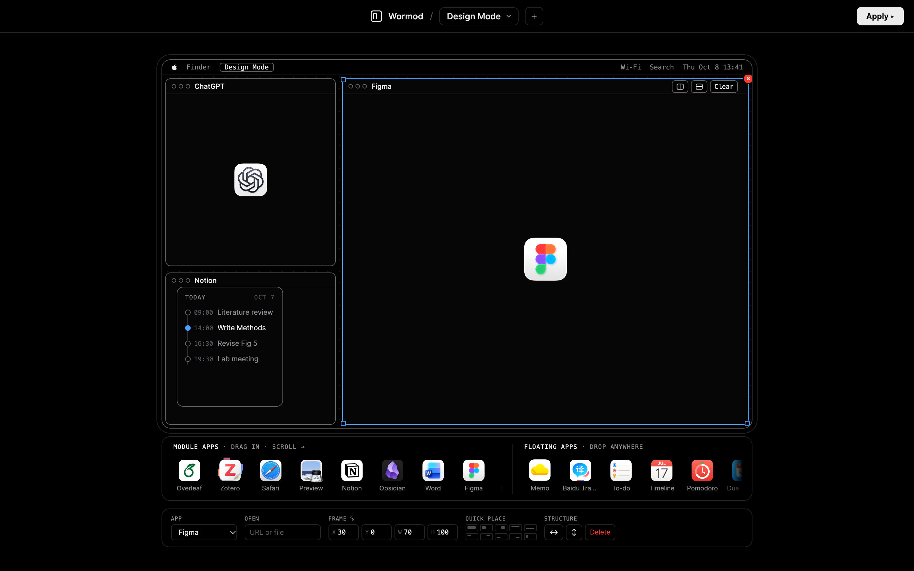
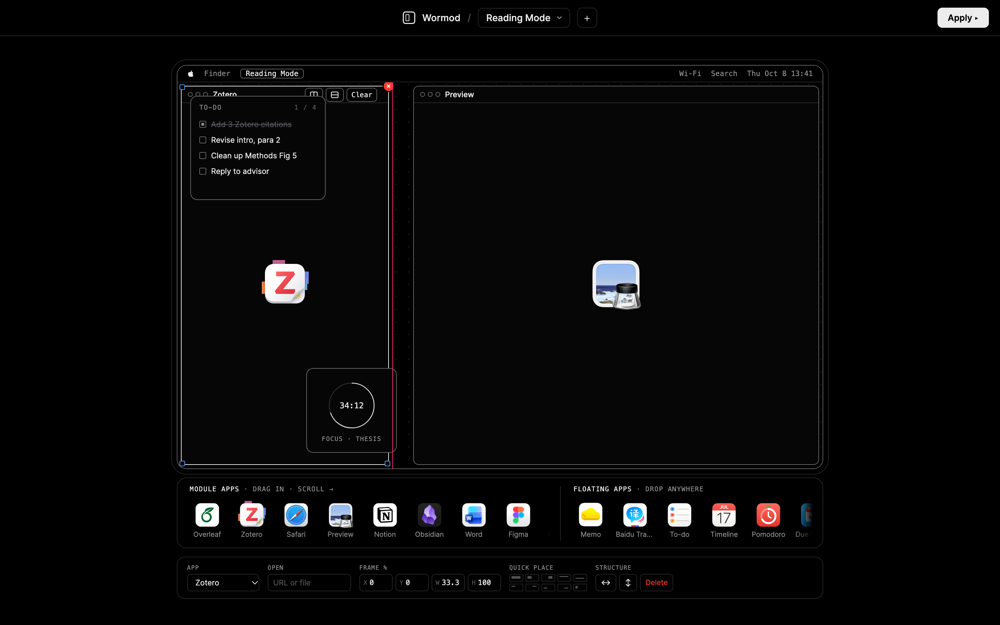
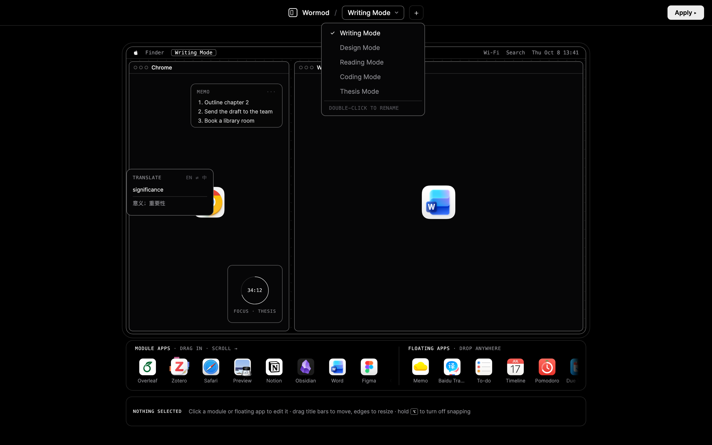
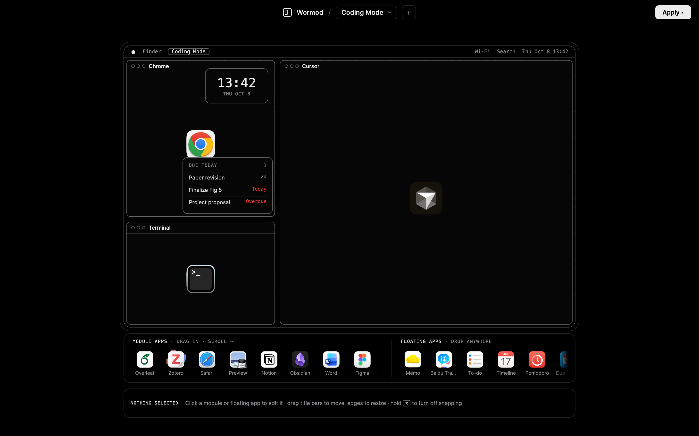
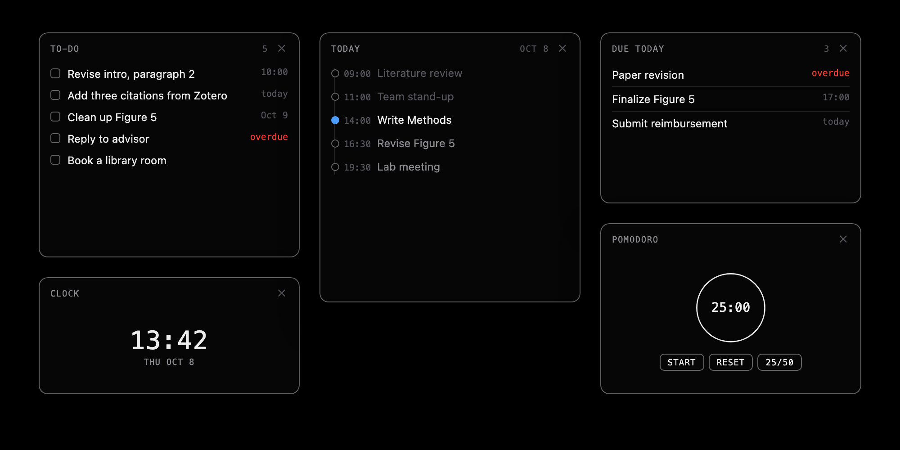
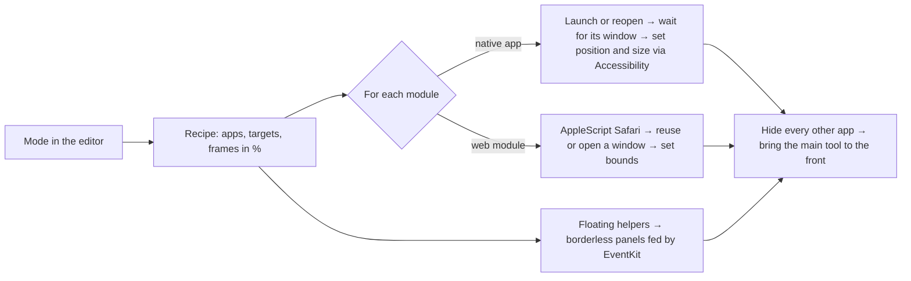

<p align="center"></p>

<h1 align="center">Wormod</h1>

<p align="center"><b>Lay out your Mac by mode.</b><br>
Draw the desktop you want for writing, reading, design or coding once.<br>
Press <b>Apply</b>, and every app opens exactly where you drew it.</p>

<p align="center">
  <a href="https://github.com/wz18907079985-ship-it/wormod/releases/latest"></a>
  
  
  
  
</p>

<p align="center">
  <a href="#features">Features</a> ·
  <a href="#everything-in-the-box">Everything in the box</a> ·
  <a href="#how-apply-works">How Apply works</a> ·
  <a href="#install">Install</a> ·
  <a href="#build-from-source">Build</a> ·
  <a href="#roadmap">Roadmap</a> ·
  <a href="#中文介绍">中文</a>
</p>

<p align="center"></p>

<table>
<tr>
<td width="25%" valign="top">

### ✏️ Draw it once
Drag apps onto a miniature screen, then move, resize and snap them. Each mode keeps its own layout.

</td>
<td width="25%" valign="top">

### ▶️ One-click Apply
Wormod opens every app, places each window on the real screen and hides everything that doesn't belong.

</td>
<td width="25%" valign="top">

### 🪟 Floating helpers
To-do, Today, Due Today, Pomodoro and Clock float on top, fed by your own Reminders and Calendar.

</td>
<td width="25%" valign="top">

### 🔒 Local only
No account, no server, no tracking. Modes are a JSON file on your Mac, and everything runs offline.

</td>
</tr>
</table>

## Features

<table>
<tr>
<td width="50%" valign="top"></td>
<td width="50%" valign="top"></td>
</tr>
<tr>
<td valign="top">

### Fine-tune every window
Click a window to edit it in the bottom bar. Swap the app, point it at a **file or URL** to open, type an exact frame in percent, or use **Quick place**: full, halves, quarters and thirds. Split a window left/right or top/bottom to make room for another app.

</td>
<td valign="top">

### Snaps where you expect
Edges snap to halves, thirds and the edges of other windows, and a pink guide shows what you're snapping to. Hold <kbd>⌥</kbd> to place freely. Windows can overlap, and the last one you touched comes to the front.

</td>
</tr>
<tr>
<td width="50%" valign="top"></td>
<td width="50%" valign="top"></td>
</tr>
<tr>
<td valign="top">

### A mode for every kind of work
Switch modes from the title bar, add one with <kbd>+</kbd>, and double-click to rename. Writing Mode, Reading Mode, Design Mode, Coding Mode: each remembers its windows, floating helpers and opacity.

</td>
<td valign="top">

### Read on the left, make on the right
The suggested layouts follow one rule: **the tool you produce in gets the most room**, on your dominant-hand side. References and search sit on the other side, and helpers float over them so they never cover your canvas.

</td>
</tr>
</table>

### Floating helpers that know your day

<p align="center"></p>

Floating apps are small borderless panels that stay on top, show on every Space and can be dragged by their header. Each one has its own opacity and on-top setting.

- **To-do** lists your incomplete Reminders. Tick a box and the reminder is completed in Reminders too.
- **Today** is a timeline of today's Calendar events, with the current one highlighted.
- **Due Today** shows what's due by tonight and flags overdue items in red.
- **Pomodoro** runs 25 or 50 minutes and plays a chime when it's done.
- **Clock** shows the time and date at a glance.
- Real apps can float too. **Memo** and **Baidu Translate** are placed as floating windows. Baidu Translate is parked against the screen edge so it tucks itself away.

## Everything in the box

<table>
<tr>
<td width="33%" valign="top">

#### 🧩 40 module apps
Overleaf · Zotero · Safari · Preview · Notion · Obsidian · Word · Figma · ChatGPT · Cursor · WeRead · Chrome · Edge · VS Code · Terminal · Finder · Notes · TextEdit · Pages · Keynote · Numbers · PowerPoint · WPS · Xmind · Freeform · Books · Grammarly · Eudic · Photoshop · Rhino · KeyShot · Mail · Outlook · Teams · VooV Meeting · Zoom · NetEase Music · WeChat · QQ · RedNote

</td>
<td width="33%" valign="top">

#### 🪟 7 floating apps
Memo · Baidu Translate · To-do (Reminders) · Today (Calendar) · Due Today · Pomodoro · Clock

#### 📐 Layout tools
Free move and resize from any edge or corner · snap to halves, thirds and neighbours · <kbd>⌥</kbd> to disable snapping · exact frames in % · quick place · split ↔ / ↕ · overlap and z-order · <kbd>Delete</kbd> / <kbd>Esc</kbd>

</td>
<td width="33%" valign="top">

#### ▶️ Apply engine
Launches or reopens apps · opens a target file or URL · places windows through the Accessibility API · web modules in Safari, reusing an open tab for the same site · minimizes unused Safari windows · hides apps outside the mode · tells you what couldn't be placed

#### 💾 Your data
Modes are saved to `~/Library/Application Support/Wormod/state.json`. No network requests, no analytics.

</td>
</tr>
</table>

## How Apply works



Frames are stored as percentages of the screen's visible area (below the menu bar, above the Dock), so a mode works on any display size.

## Install

1. Download **Wormod.zip** from the [latest release](https://github.com/wz18907079985-ship-it/wormod/releases/latest), unzip, and move `Wormod.app` to Applications.
2. Wormod isn't notarized yet. On first launch, **right-click → Open**, or click **Open Anyway** in System Settings → Privacy & Security.
3. Press **Apply**. macOS will ask for the permissions below once.

| Permission | Why |
|---|---|
| Accessibility | Move and resize other apps' windows |
| Automation → Safari | Open and place web modules such as Overleaf and Notion |
| Calendars | The Today widget |
| Reminders | The To-do and Due Today widgets |

Requires macOS 13 Ventura or later on Apple silicon.

## Build from source

```sh
git clone https://github.com/wz18907079985-ship-it/wormod.git
cd wormod/app
./build.sh        # compiles, bundles, signs and installs /Applications/Wormod.app
```

You need the Xcode command line tools (`swiftc`). `build.sh` signs ad-hoc unless a code-signing identity named `Workspace Editor Local Signing` exists in your keychain. A stable identity keeps the Accessibility permission across rebuilds.

| Path | |
|---|---|
| `index.html` | The editor UI: vanilla HTML, CSS and JS, no build step |
| `widget.html` | Floating widget panels |
| `icons/` | App icons used in the dock |
| `app/main.swift` | Native shell: WKWebView, window placement, Safari scripting, EventKit |
| `app/icon.swift` | Draws the app icon |
| `app/build.sh` | Build, sign and install |

The editor also runs in a normal browser (open `index.html`). Everything works except **Apply**.

## Roadmap

- [ ] Triggers: switch mode automatically from a calendar event, Wi-Fi network or time of day
- [ ] Suggested modes from your app usage
- [ ] Multiple displays
- [ ] Left-handed layout preset
- [ ] Universal build (Intel) and notarized releases

Ideas and pull requests are welcome. Open an [issue](https://github.com/wz18907079985-ship-it/wormod/issues).

---

## 中文介绍

**Wormod：按「模式」排布你的 Mac。**

给写作、阅读、设计、编程等不同场景各画一个桌面布局。按一下 **Apply**，Wormod 会打开对应的软件，把每个窗口放到你画的位置，再显示悬浮小组件，并隐藏所有无关的软件。

- **画一次就够**：把软件从下方的 Dock 拖进小屏幕，自由移动、缩放，自动吸附到二分、三分和相邻窗口的边缘。
- **一键 Apply**：本地软件通过「辅助功能」接口摆放窗口；Overleaf、Notion 等网页模块在 Safari 中打开。
- **悬浮小组件**：待办（提醒事项）、今日日程（日历）、今日截止、番茄钟、时钟，数据来自你自己的提醒事项和日历。
- **左边输入、右边输出**：产出类工具占最大面积，放在惯用手一侧；查资料的工具放在另一侧，悬浮组件压在资料区上，不挡画布。
- **纯本地**：不需要账号，不联网，模式只是你 Mac 上的一个 JSON 文件。

下载：[最新版本](https://github.com/wz18907079985-ship-it/wormod/releases/latest)。首次打开请右键 →「打开」，然后按提示允许「辅助功能」权限。

## License

[MIT](LICENSE)
