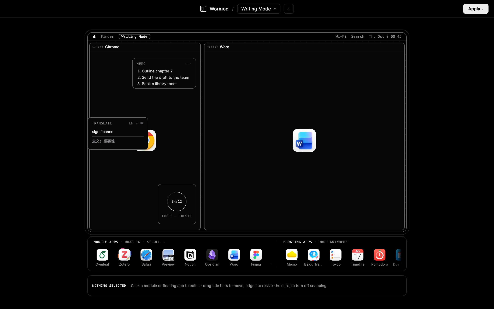

<p align="center"></p>

<h1 align="center">Wormod</h1>

<p align="center">Lay out your Mac by mode. Draw the desktop you want once, then press <b>Apply</b>.</p>

<p align="center"></p>

## What it does

- **Modes**: keep a layout per activity: writing, reading, design, coding…
- **Module windows**: drag apps from the dock onto the screen, then move, resize and snap them. Each module can open a specific file or URL.
- **Floating apps**: small always-on-top helpers such as Memo, a translator, To-do (Reminders), Today (Calendar), Due Today, Pomodoro and Clock.
- **Apply**: opens every app in the mode, puts each window exactly where you drew it, opens web modules (Overleaf, Notion) in Safari, shows the floating widgets and hides everything else.

## Install

1. Download `Wormod.zip` from [Releases](../../releases), unzip, and move `Wormod.app` to Applications.
2. The app is not notarized. On first launch, right-click it → **Open**, or allow it in System Settings → Privacy & Security.
3. On the first **Apply**, grant:
   - **Accessibility**, to move and resize other apps' windows
   - **Automation → Safari**, for web modules
   - **Calendars / Reminders**, only if you use those widgets

Requires macOS 13 or later on Apple silicon.

## Build from source

```sh
git clone https://github.com/wz18907079985-ship-it/wormod.git
cd wormod/app
./build.sh        # compiles, bundles and installs /Applications/Wormod.app
```

Needs the Xcode command line tools (`swiftc`). `build.sh` signs ad-hoc unless a code-signing identity named `Workspace Editor Local Signing` exists. A stable identity keeps the Accessibility permission across rebuilds.

## Project layout

| Path | |
|---|---|
| `index.html` | The editor UI (vanilla HTML/CSS/JS) |
| `widget.html` | Floating widget panels |
| `icons/` | App icons shown in the dock |
| `app/main.swift` | Native shell: WKWebView, window placement, Safari scripting, EventKit widgets |
| `app/icon.swift` | Draws the app icon |
| `app/build.sh` | Build, sign and install |

Saved modes live in `~/Library/Application Support/Wormod/state.json`.

---

## 中文简介

Wormod 是一个 macOS 桌面模式编辑器：给写作、阅读、设计等不同场景各画一个桌面布局，按一下 **Apply**，它就会打开对应的软件，把每个窗口放到你画的位置，显示悬浮小组件（便签、翻译、待办、日程、番茄钟），并隐藏其他软件。

## License

[MIT](LICENSE)
